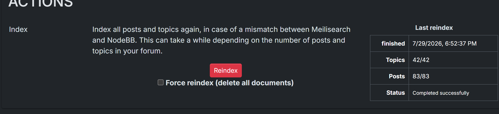
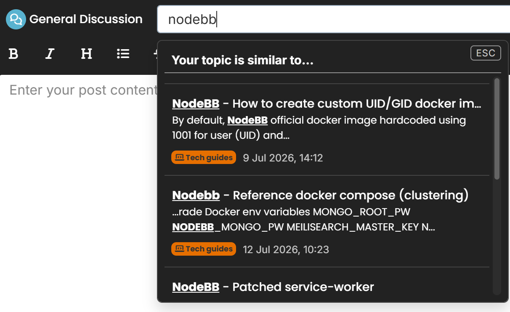

# Meilisearch Plugin for NodeBB (Refactored)
A plugin for integrating MeiliSearch with NodeBB (This plugin is inspired and refactored from the original [nodebb-plugin-meilisearch](https://github.com/oplik0/nodebb-plugin-meilisearch))

***__Make sure to disable nodebb-plugin-dbsearch when using this plugin.__***

**Required existing Meilisearch instance. Set your URL and API Key in the ACP**

- Refactored for NodeBB 4.14 up.
- Updated to Meilisearch JS API 0.59.
- Fixed admin layout panel.
- Reindex / Force reindex all working as expected
- Composer suggestion optimization.
- Bug fixes from existing plugin.

\

